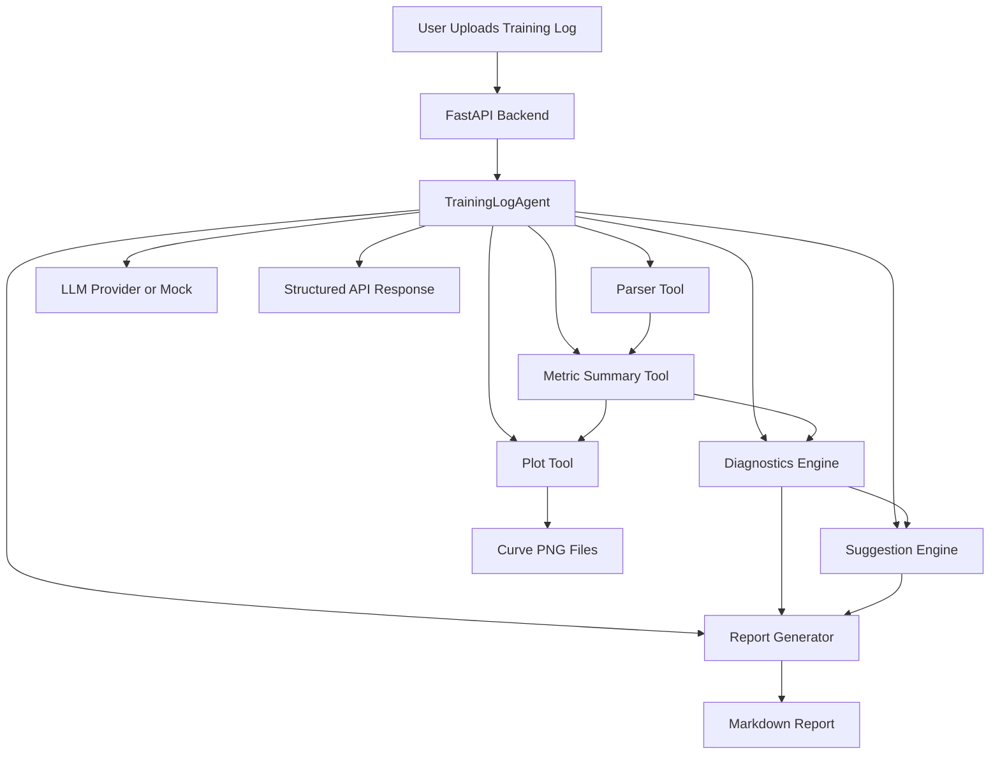
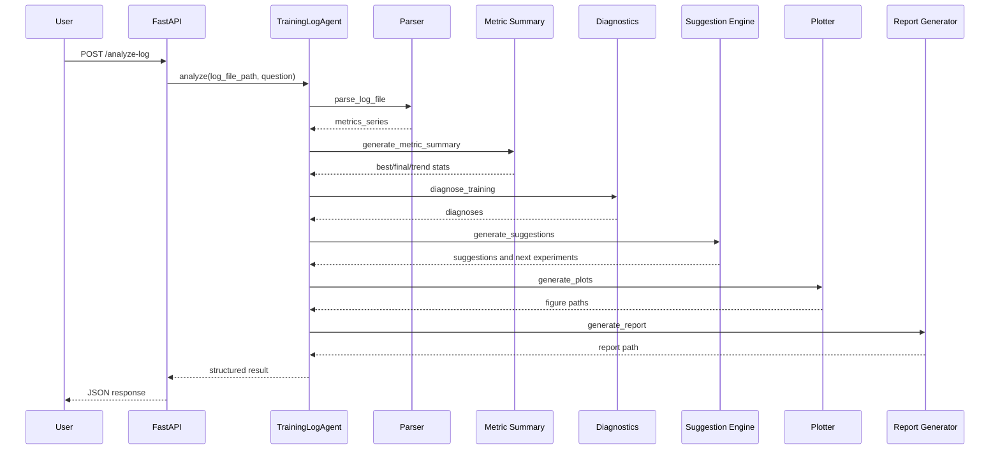
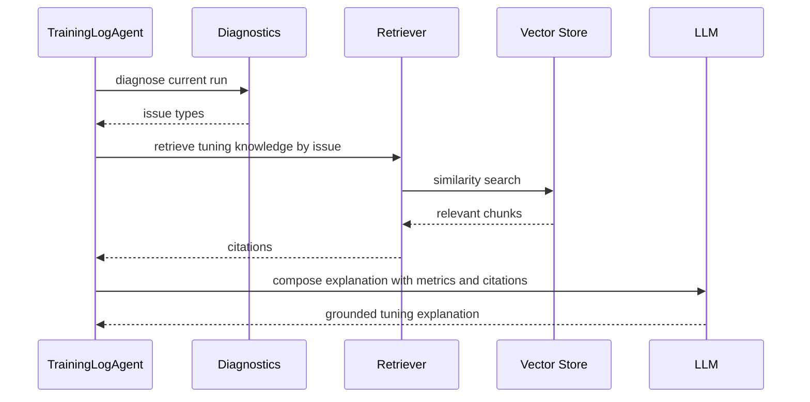

# Training Log Agent 架构说明

## 项目整体架构

Training Log Agent 是一个 Rule-based / Tool Agent。它没有把 RAG 作为主流程，因为核心输入是训练日志和指标表，最重要的是稳定解析、统计、诊断和报告生成。



## 模块说明

| 模块 | 作用 |
| --- | --- |
| `app/` | FastAPI 上传、分析、问答、报告和图片下载 |
| `agent/` | `TrainingLogAgent` 主编排流程 |
| `core/log_parser.py` | 支持 text、CSV、JSON 的日志解析 |
| `core/metric_summary.py` | best/final/recent window 统计 |
| `core/diagnostics.py` | 训练问题诊断规则 |
| `core/suggestion_engine.py` | 调参建议和下一步实验生成 |
| `core/plotter.py` | 训练曲线绘制 |
| `core/report_generator.py` | Markdown 报告生成 |
| `llm/` | mock 和 OpenAI-compatible provider |
| `frontend/` | Streamlit Demo |
| `tests/` | 单元测试和 API 冒烟测试 |

## 数据流说明

1. 用户上传 `.log`、`.txt`、`.csv` 或 `.json`。
2. API 保存到 `uploads/`。
3. API 将分析路径限制在 `uploads/` 和 `examples/` 两个安全目录内。
4. Agent 调用 parser 生成统一的 `metrics_series`。
5. Summary 计算 best/final metric、趋势、loss gap 和 class gap。
6. Diagnostics 根据规则生成问题列表，每条包含 type、severity、evidence、suggestion。
7. Suggestion engine 生成 priority suggestions 和 next experiments。
8. Plotter 输出曲线图到 `reports/figures/`。
9. Report generator 输出 Markdown 到 `reports/`。
10. API 返回结构化 JSON，前端渲染指标、诊断、曲线和下载按钮。

## Agent 工作流说明

`TrainingLogAgent.analyze()` 是主入口：

```text
parse_log_file
-> generate_metric_summary
-> diagnose_training
-> generate_suggestions
-> generate_plots
-> generate_report
-> answer_question(optional)
```

它的设计重点是确定性和可解释：数值来自 parser 和 summary，诊断来自规则，LLM 只用于回答用户的附加问题。

## Tool Calling 流程说明



## RAG 流程说明

本项目没有 RAG 主流程，这是有意取舍。Training Log Agent 的输入主要是日志和指标表，关键挑战是结构化解析和诊断规则，而不是从大量知识文档中检索答案。因此它更适合定位为 Rule-based Agent / Tool Agent。

如果后续要扩展 RAG，可以增加：

- 调参知识库：学习率、scheduler、loss、augmentation 文档。
- 历史实验库：相似日志检索和经验复用。
- 论文方法库：把诊断问题映射到相关论文策略。

扩展后的 RAG 时序可以是：


